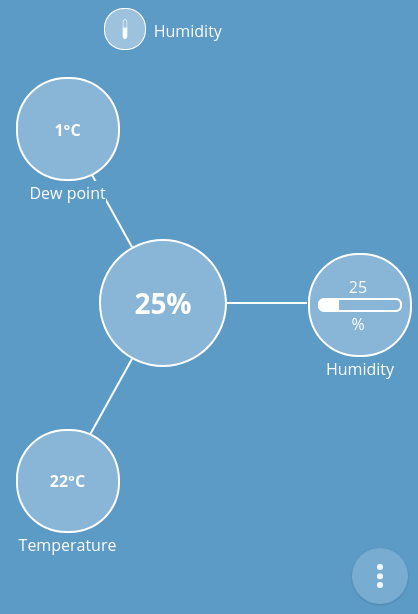
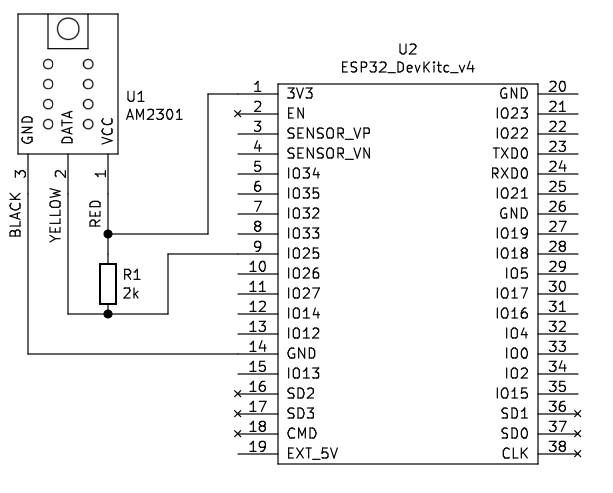

# IoT Thing: Humidity sensor (AM2301/DHT21)

## Introduction

This is web connected humidity and temperature sensor based on AM2301/HT21 sensor.

## Dependencies

Requires:

 * [Web Thing Server](https://github.com/KrzysztofZurek1973/iot_components/tree/master/web_thing_server)


## Features

Humidity sensor thing has `MultiLevelSensor` @type and following read-only properties:

* `humidity`, range 0..100 %, @type `LevelProperty`
* `temperature`, range -40..80 Celsius, @type `LevelProperty`
* `dew point`, range -20..40 Celsius, @type `TemperatureProperty`

## Documentation

Start thing by running the following code
	
	```
	root_node_init();

	//initialize thing and add to the thing server
	add_thing_to_server(init_humidity_sensor_am2301("am2302 sensor"));
	```
Data is read from sensor every 5 seconds (2 seconds are minimal according to AM2301 documentation). Sensor data include parity byte to validate data correctness. If the parity byte check fails, the received data is ignored.

The humidity and temperature obtained from sensor are used to calculate dew point. If the node has websocket clients data is sent to them if:

- temperature: |last sent temperature - current temperature| >= 0.1 
- humidity: |last sent humidity - current humidity| >= 1
- dew point: |last sent dew point - current dew point| >= 0.5

or 30 seconds have passed since the last data was sent.

AM2301 generates random spikes in temperature values, so you can enable digital filtering of received data. The filter introduces a dalay of about 100 sec between the data read from the sensor and the data sent to clients.

### Configuration

GPIO number for receiving data from sensor can be set in `idf.py menuconfig -> Humidity sensor AM2301 -> AM2301 data GPIO number`. Default is 25.

Digital filltering is enabled in `idf.py menuconfig -> Humidity sensor AM2301 -> Enable sensor data filtering`. By default fillering is enabled.

### Gateway web interface



### Scheme



## Source Code

The source is available from [GitHub](https://github.com/KrzysztofZurek1973/iot_components/tree/master/thing_button).

## License

The code in this project is licensed under the MIT license - see LICENSE for details.

## Authors

* **Krzysztof Zurek** - [kz](https://github.com/KrzysztofZurek1973)

